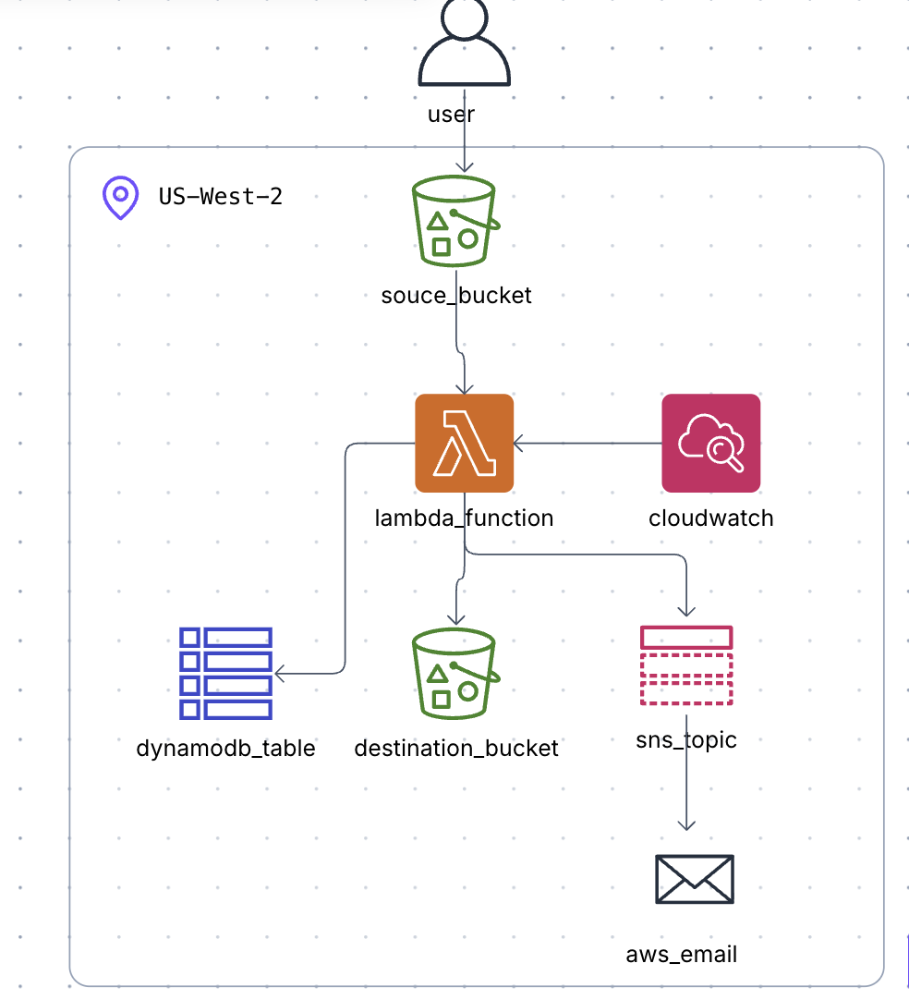

# Serverless-Image-Processing
This repository contains terraform infrastructure code that implements a serverless image processing system. 

This codebase contains both the source and infrastructure code that are necessary for the system.

# Overview 👀

  
    

Serverless is a cloud execution model where you write and deploy code without managing servers. The cloud provider automatically handles:

 - Infrastructure provisioning

 - Scaling up/down

 - High availability
  
 - Patch management

It is an exciting new cloud computing paradigm where you pay only for actual execution time, not idle servers.

In this example we are using [AWS Serverless](https://aws.amazon.com/serverless/) technology to create an image processing system.

## Components
The following are the components used in this project:
 - [Amazon S3](https://aws.amazon.com/s3/?trk=3d8e0834-4a13-43d9-9142-a95c86f6929f&sc_channel=ps&trk=3d8e0834-4a13-43d9-9142-a95c86f6929f&sc_channel=ps&ef_id=Cj0KCQiAyP3KBhD9ARIsAAJLnnaNTmdEg1mCl4gKtVcQI9Q6bmXNFFv_-Kkg2IkvVWoVmyHZ6Baf4qsaArjgEALw_wcB:G:s&s_kwcid=AL!4422!3!785447140458!e!!g!!aws%20s3!23291342325!188768692203&gad_campaignid=23291342325&gbraid=0AAAAADjHtp9OQEhw4KpWMi_6riU35zYIx&gclid=Cj0KCQiAyP3KBhD9ARIsAAJLnnaNTmdEg1mCl4gKtVcQI9Q6bmXNFFv_-Kkg2IkvVWoVmyHZ6Baf4qsaArjgEALw_wcB): Amazon Simple Storage Service (Amazon S3) is an object storage service offering industry-leading scalability, data availability, security, and performance.
 - [AWS Lambda](https://aws.amazon.com/pm/lambda/?trk=065f9330-e033-4770-bfd7-4af000a338f2&sc_channel=ps&trk=065f9330-e033-4770-bfd7-4af000a338f2&sc_channel=ps&ef_id=Cj0KCQiAyP3KBhD9ARIsAAJLnnZOr4GvMhMQPAEUX4j8GHVEmV61hCVf0K1LJ4TPTAduJyIQsVapSeQaAicOEALw_wcB:G:s&s_kwcid=AL!4422!3!785483253781!e!!g!!aws%20lambda!23300619076!189486859415&gad_campaignid=23300619076&gbraid=0AAAAADjHtp8Z-4m5FmKk1gcss6H3jahHT&gclid=Cj0KCQiAyP3KBhD9ARIsAAJLnnZOr4GvMhMQPAEUX4j8GHVEmV61hCVf0K1LJ4TPTAduJyIQsVapSeQaAicOEALw_wcB): AWS Lambda is a compute service that runs your code in response to events and automatically manages the compute resources.
 - [Amazon CloudWatch](https://aws.amazon.com/cloudwatch/): CloudWatch is an intelligent observability service that provides actionable insights across applications and infrastructure.
 - [Amazon DynamoDB](https://aws.amazon.com/dynamodb/?trk=55da752f-45a7-4b2f-b07c-d90d7c2eb6d5&sc_channel=ps&trk=55da752f-45a7-4b2f-b07c-d90d7c2eb6d5&sc_channel=ps&ef_id=Cj0KCQiAyP3KBhD9ARIsAAJLnnb0f07lnM_tPdm4k5YtXCIecnfYT-qKzIIORG4cYvSlb3O5_gVaqx0aAhmBEALw_wcB:G:s&s_kwcid=AL!4422!3!785574063590!e!!g!!amazon%20dynamodb!23300619517!195951875264&gad_campaignid=23300619517&gbraid=0AAAAADjHtp-PL34_sEGW34UkO6gqxTnVh&gclid=Cj0KCQiAyP3KBhD9ARIsAAJLnnb0f07lnM_tPdm4k5YtXCIecnfYT-qKzIIORG4cYvSlb3O5_gVaqx0aAhmBEALw_wcB): DynamoDB is a serverless, fully managed database that instantly scales to fit your applications' needs with zero infrastructure management, zero downtime maintenance, and zero maintenance windows.
 - [AWS IAM](https://aws.amazon.com/iam/?trk=505f0d86-e891-4dca-81fd-6f5a2bc819a4&sc_channel=ps&trk=505f0d86-e891-4dca-81fd-6f5a2bc819a4&sc_channel=ps&ef_id=Cj0KCQiAyP3KBhD9ARIsAAJLnnZG-xhrkR2ekbTziO_KxyTSPVniiI6rFmdfbcOzXW4LF5m9Fh9E4gMaAl9jEALw_wcB:G:s&s_kwcid=AL!4422!3!785574083510!e!!g!!amazon%20iam!23291341866!194328866772&gad_campaignid=23291341866&gbraid=0AAAAADjHtp-cNR21eLrUqQST6uvyJOPaC&gclid=Cj0KCQiAyP3KBhD9ARIsAAJLnnZG-xhrkR2ekbTziO_KxyTSPVniiI6rFmdfbcOzXW4LF5m9Fh9E4gMaAl9jEALw_wcB): AWS Identity and Access Management (IAM) is a globally scoped AWS service that enables organizations to securely define, manage, and enforce fine-grained permissions for identities and resources, ensuring that the right principals have the appropriate level of access to AWS services and assets.
 - [Amazon SNS](https://aws.amazon.com/sns/): Amazon Simple Notification Service (SNS) is a fully managed, highly scalable publish–subscribe messaging service that enables the decoupled, asynchronous delivery of messages and event notifications to multiple subscribers across distributed systems and applications.

## Workflow
Below is the chain of events that occur in this architecture:
  1. User uploads image to **Source S3 Bucket**
  2. **AWS Lambda Function** gets triggered
  3. **AWS Lambda Function** runs image processing code
  4. **CloudWatch** monitors and collects logs from **AWS Lambda Function**
  5. **AWS Lambda Function** persists processed image to **Destination S3 Bucket**
  6. **AWS Lambda Function** persists metadata to **DynamoDB Table**
  7. **AWS Lambda Function** sends message to **SNS Topic**
  8. **SNS Topic** sends email to designated/provided email address

# Pre-requistites 📝
The following are pre-requistes that are necessary to successfully use this package and deploy the desired infrastructure:
  - [**A GitHub Account**](https://docs.github.com/en/get-started/start-your-journey/creating-an-account-on-github)
  - [**An AWS Account**](https://docs.aws.amazon.com/accounts/latest/reference/manage-acct-creating.html)
  - [**AWS CLI**](https://docs.aws.amazon.com/cli/latest/userguide/cli-chap-getting-started.html)
  - [**Terraform**](https://developer.hashicorp.com/terraform/install)
  - [**Terraform CLI**](https://developer.hashicorp.com/terraform/tutorials/aws-get-started/install-cli)

# Usage 🛠️
## Email
This project requires the user to specify an email address using [terraform.tfvars](https://developer.hashicorp.com/terraform/language/values/variables) file. Please follow the steps below:
  1. Create a file named **terraform.tfvars** file in the root directory
  2. Add `email_endpoint="YOUR_EMAIL_ADDRESS"` and save the file

## Makefile
This project utlisies a **Makefile** for convinience and ease of development. The following are the commands that are pertinent to this project:

`make init`

Initializes the project

`make run`

Updates lambda source code

`make plan`

Displays planned changes

`make deploy`

Deploys desired infrastructure

`make destroy`

Removes deployed infrastructure

# Forking & Contribution 🍴
This project is a great base for further development. Some ideas for extending/building upon this project:

🌐 Web & mobile apps
  - Profile photo resizing

  - Product image optimization

  - User-generated content pipelines

🛒 E-commerce

  - Dynamic product thumbnails

  - Watermarking

  - CDN-ready assets

📸 Media & SaaS platforms

  - Photo moderation

  - AI-based tagging

  - Searchable image libraries

🔐 Enterprise & compliance

  - Document image processing

  - Redaction & OCR

  - Audit-ready pipelines

Users are more than welcome to fork this repository and build upon it, however, do keep in mind the following: [LICENSE](https://github.com/shahLLL/serverless-image-processing?tab=Apache-2.0-1-ov-file)

Likewise contributions to this repository are welcome as well but the intention is to keep this repository as a base serverless image processing system. Fully fledged products/systems should be in different repositories that have been forked from this one.

☕☕☕**CHEERS AND THANK YOU**☕☕☕
